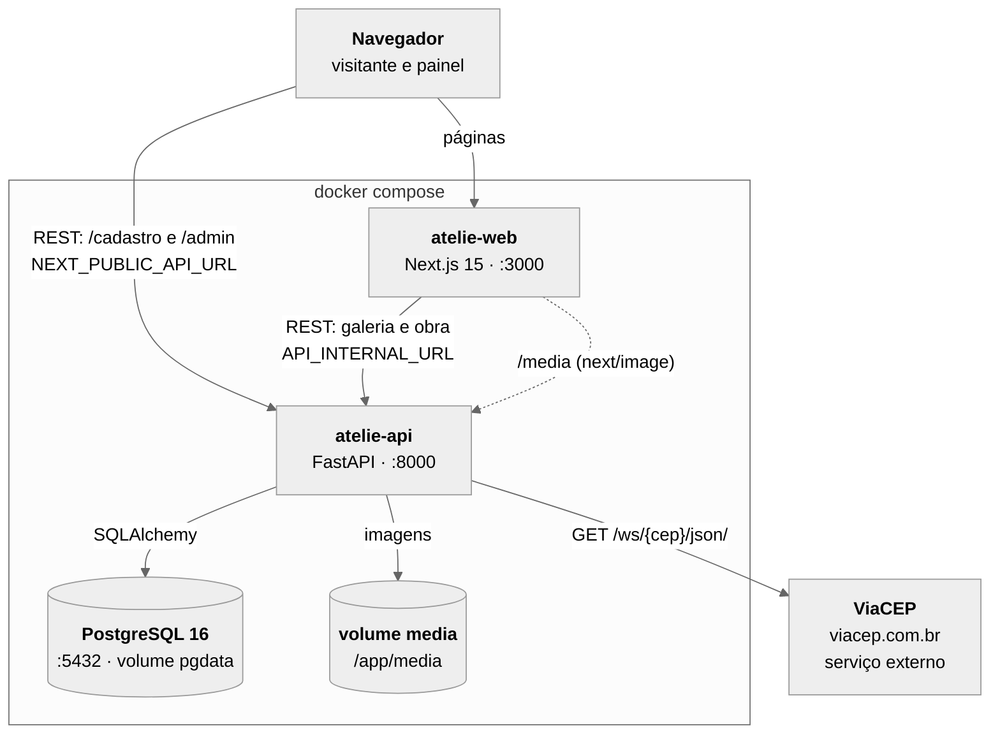
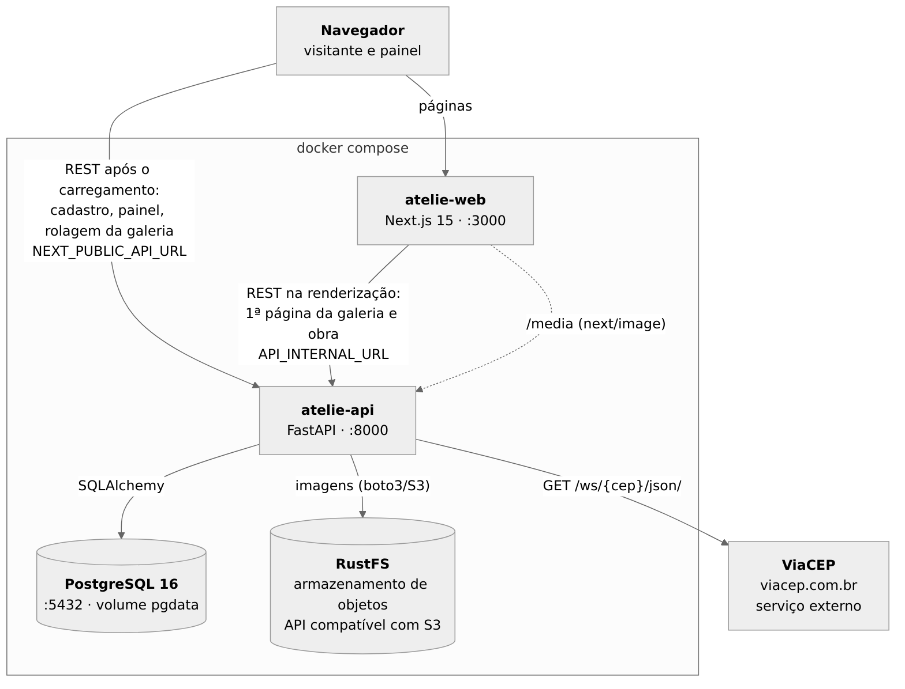

# atelie-web

Interface do **Ateliê**, catálogo online de fotografias em print e quadro. Tem uma galeria
pública das obras, a página de cada obra, um cadastro de clientes interessados com
endereço preenchido a partir do CEP e um painel simples onde a fotógrafa sobe as fotos e
define preço.

Next.js 15 (App Router), TypeScript e Tailwind CSS. Este repositório também guarda o
`docker-compose.yml` que sobe o sistema inteiro.

Repositório da API: `atelie-api` — FastAPI, SQLAlchemy e PostgreSQL.

## Arquitetura



A mesma figura em imagem: [`docs/arquitetura.png`](docs/arquitetura.png) (gerada a partir
de [`docs/arquitetura.mmd`](docs/arquitetura.mmd)).



| Componente | Papel |
| --- | --- |
| **atelie-web** | Interface. Renderiza as páginas e chama a API via REST. |
| **atelie-api** | API REST. Regras de negócio, upload de imagens e consumo do ViaCEP. |
| **PostgreSQL** | Persistência das obras (`photos`) e dos clientes (`customers`). |
| **ViaCEP** | Serviço externo de consulta de CEP, chamado **somente pela API**. |

### Duas URLs para a mesma API

A interface alcança a API por dois caminhos, e a escolha está concentrada num único
arquivo, [`src/lib/api.ts`](src/lib/api.ts) — nenhum componente monta URL de API por
conta própria.

- **Servidor do Next** (galeria e página da obra, que são Server Components): fala com
  `API_INTERNAL_URL` = `http://api:8000`, o nome do serviço na rede interna do Docker.
- **Navegador** (cadastro e painel, que são Client Components): fala com
  `NEXT_PUBLIC_API_URL` = `http://localhost:8000`, a porta publicada no host. O navegador
  não conhece o nome `api`; por isso a API libera essa origem no CORS.

As imagens são um terceiro caso: quem baixa o arquivo original é o otimizador do
`next/image`, que roda no servidor. O [`next.config.ts`](next.config.ts) reescreve
`/media/*` para `API_INTERNAL_URL/media/*`, e os componentes usam o `image_path` relativo
devolvido pela API (`/media/a1b2.jpg`).

## Pré-requisitos

Docker e Docker Compose v2. Nada de Node nem Python no host: todo comando de
desenvolvimento roda em contêiner.

## Os dois repositórios lado a lado

Interface e API vivem em repositórios git separados e precisam ser clonados **lado a
lado**, com estes nomes:

```
./atelie-web/     # este repositório (contém o docker-compose.yml)
./atelie-api/
```

O serviço `api` do compose usa `build.context: ../atelie-api`, porque o código da API
não está neste repositório: o Docker precisa ler a pasta vizinha para construir a imagem
e para o bind mount do hot reload. Se as pastas não estiverem lado a lado com esses
nomes, o build da API falha. O mesmo aviso está comentado no topo do
`docker-compose.yml`.

## Instalação e execução

```bash
# na mesma pasta, clone os dois repositórios
git clone <url-do-repositorio>/atelie-web.git
git clone <url-do-repositorio>/atelie-api.git
cd atelie-web
cp .env.example .env
docker compose up --build
```

Os três serviços sobem com healthcheck (`db` → `api` → `web`, cada um esperando o
anterior ficar saudável).

| Endereço | O que é |
| --- | --- |
| http://localhost:3000 | Interface |
| http://localhost:3000/admin | Painel (pede o `ADMIN_TOKEN` do `.env`) |
| http://localhost:8000/docs | Swagger da API |
| http://localhost:8000/health | Health check da API e do banco |

Para popular o catálogo com 20 obras de exemplo e 5 clientes (as fotos são imagens do
Unsplash versionadas na `atelie-api`, sob a Unsplash License — ver os créditos no
repositório da API):

```bash
docker compose exec api python -m scripts.seed
```

Hot reload nos dois serviços: o código vem do host por bind mount. Para derrubar tudo,
incluindo banco e imagens:

```bash
docker compose down -v
```

## Variáveis de ambiente

O `.env` na raiz deste repositório alimenta os três serviços do compose. Ele **não** é
versionado; o modelo versionado é o [`.env.example`](.env.example).

| Variável | Serviço | Descrição | Valor padrão |
| --- | --- | --- | --- |
| `POSTGRES_DB` | db | Nome do banco | `atelie` |
| `POSTGRES_USER` | db | Usuário do banco | `atelie` |
| `POSTGRES_PASSWORD` | db | Senha do banco | `atelie` |
| `DATABASE_URL` | api | Conexão SQLAlchemy (host `db` dentro do compose) | `postgresql+psycopg://atelie:atelie@db:5432/atelie` |
| `CORS_ORIGINS` | api | Origens liberadas no CORS, separadas por vírgula | `http://localhost:3000` |
| `ADMIN_TOKEN` | api | Token esperado no header `X-Admin-Token` | `troque-este-token` |
| `API_INTERNAL_URL` | web | API vista pelo **servidor** do Next | `http://api:8000` |
| `NEXT_PUBLIC_API_URL` | web | API vista pelo **navegador** | `http://localhost:8000` |

### Acessando a VM de outra máquina

`NEXT_PUBLIC_API_URL` é o endereço da API visto pelo navegador. Com o valor padrão, as
telas que chamam a API pelo navegador (`/cadastro` e `/admin`) só funcionam num
navegador rodando na própria máquina do Docker. Se você abre a interface de outra
máquina da rede (ex.: `http://192.168.0.2:3000`), `localhost` passa a ser a sua máquina.
Nesse caso, ajuste o `.env` com o IP da VM:

```bash
NEXT_PUBLIC_API_URL=http://192.168.0.2:8000
CORS_ORIGINS=http://localhost:3000,http://192.168.0.2:3000
```

e recrie os serviços com `docker compose up -d`. A galeria e a página da obra não são
afetadas, porque buscam os dados pela rede interna.

## Páginas

| Rota | Tela | Chamadas à API |
| --- | --- | --- |
| `/` | Galeria das obras publicadas, com busca por texto e filtro por categoria | `GET /api/photos` |
| `/obra/[id]` | Foto grande, descrição, formatos e preço em BRL | `GET /api/photos/{id}` |
| `/cadastro` | Cadastro de cliente com endereço preenchido pelo CEP | `GET /api/cep/{cep}`, `POST /api/customers` |
| `/admin` | Painel: nova obra com upload, edição inline e exclusão | `GET`, `POST`, `PUT` e `DELETE /api/photos` |

O mapeamento detalhado de cada método HTTP para a tela e o botão que o dispara está em
[`docs/http-methods.md`](docs/http-methods.md).

Toda tela que busca dados tem estado de carregando, vazio e erro. A busca e o filtro da
galeria funcionam sem JavaScript no cliente: o formulário faz `GET` na própria página e o
estado fica na URL (`/?q=serra&category=paisagem`).

## ViaCEP

### O que é

O [ViaCEP](https://viacep.com.br) é um webservice público e gratuito de consulta de CEP
brasileiro. A partir de um CEP de 8 dígitos, devolve logradouro, bairro, cidade, UF e
códigos auxiliares (IBGE, DDD).

### Cadastro e termos de uso

- **Não exige cadastro**, chave de API nem autenticação.
- O uso é gratuito. O serviço não publica limite de requisições, mas avisa que o abuso
  leva a bloqueio: "Uso massivo para validação de bases de dados locais, poderá
  automaticamente bloquear seu acesso".
- O ViaCEP orienta validar o formato do CEP antes de consultar e tratar a resposta de CEP
  inexistente.

No Ateliê a consulta é pontual e iniciada por uma pessoa: só acontece quando alguém sai
do campo CEP com 8 dígitos, não é refeita para um CEP que já foi encontrado e um CEP
malformado é recusado pela nossa API antes de qualquer chamada externa.

### Rota consumida

```
GET https://viacep.com.br/ws/{cep}/json/
```

O navegador **nunca** chama o ViaCEP. A interface só conhece a rota da nossa API,
`GET /api/cep/{cep}`; a `atelie-api` consulta o ViaCEP e converte a resposta para o
nosso schema:

| Campo do ViaCEP | Campo da nossa API |
| --- | --- |
| `logradouro` | `street` |
| `bairro` | `district` |
| `localidade` | `city` |
| `uf` | `state` |

### Tratamento de erro

| Situação | Resposta da nossa API | O que a tela de cadastro mostra |
| --- | --- | --- |
| CEP encontrado | `200` com o endereço | Preenche rua, bairro, cidade e UF e foca o número |
| CEP fora do formato de 8 dígitos | `422`, sem consultar o ViaCEP | O campo não dispara a consulta |
| ViaCEP responde `{"erro": true}` (CEP inexistente) | `404` | "CEP não encontrado" |
| ViaCEP não responde a tempo (5 s) | `504` | "O serviço de CEP está fora do ar" |
| ViaCEP fora do ar ou resposta inválida | `502` | "O serviço de CEP está fora do ar" |
| Navegador não alcança a nossa API | — | "Não foi possível falar com o servidor" |

Nos casos de erro, o endereço pode ser preenchido à mão. A implementação da consulta
está em `atelie-api/app/services/viacep.py`, e a da tela em
[`src/components/CustomerForm.tsx`](src/components/CustomerForm.tsx).

## Painel e o token de administração

O painel **não tem autenticação real**. O campo no topo de `/admin` recebe o valor de
`ADMIN_TOKEN`, enviado no header `X-Admin-Token` das rotas de escrita de fotos. O token
fica só em estado de memória do React: não vai para `localStorage`, cookie nem URL, e
some ao recarregar a página.

> **Isto é um placeholder de MVP acadêmico, não autenticação.** Não há usuários, sessões,
> senhas nem expiração. Num sistema real, trocar por autenticação de verdade.

## Decisões e limitações conhecidas

- **Obra inexistente responde `200`.** A página da obra tem estado de carregamento
  (`loading.tsx`), o que faz o Next enviar a resposta em streaming; quando a obra não
  existe, o status já foi enviado. A tela mostra "Obra não encontrada" e o Next marca a
  página com `noindex`. Sem o `loading.tsx` o status seria `404`, mas a tela perderia o
  estado de carregamento.
- **Healthcheck em `/healthz`.** Rota leve que não renderiza página nem chama a API, para
  a saúde do `web` não depender da `api`.
- **Galeria sem paginação na tela.** A API pagina (`limit`/`offset`); a galeria pede até
  100 obras, suficiente para o catálogo do MVP.

## Qualidade

```bash
docker compose exec web npm run lint     # eslint
docker compose exec web npx tsc --noEmit # checagem de tipos
```

Sem `any` e sem `console.log` no código; componentes React em PascalCase.

## Estrutura

```
src/
  app/            rotas do App Router (/, /obra/[id], /cadastro, /admin, /healthz)
  components/     componentes React (PascalCase)
  lib/            cliente da API, tipos, formatação, máscaras
docs/
  arquitetura.mmd / arquitetura.png   diagrama da arquitetura
  http-methods.md                     método HTTP → tela
```
