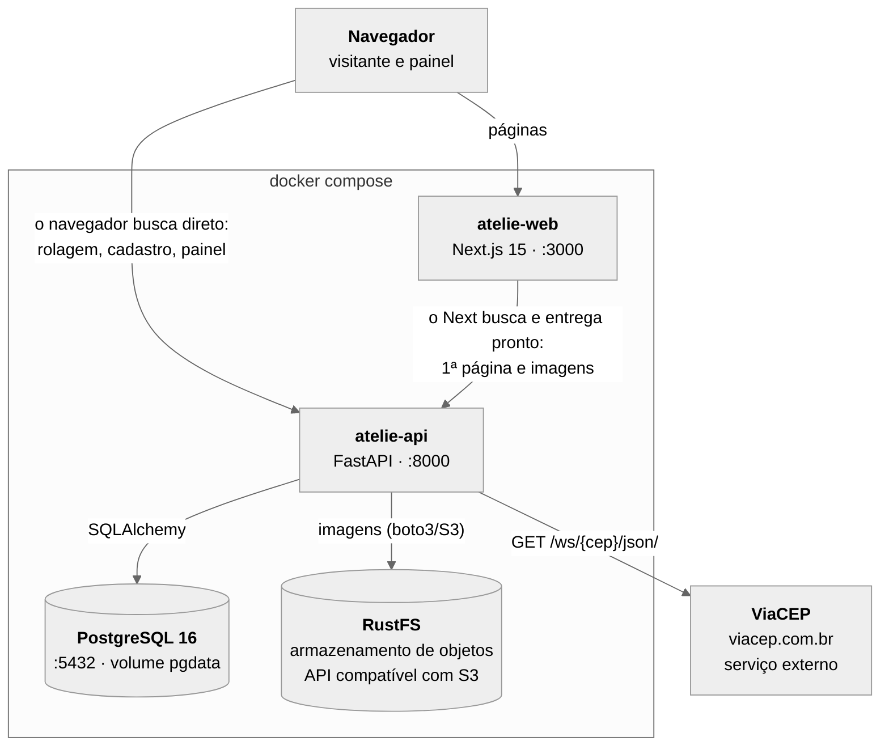

# atelie-web

Interface do **Ateliê**, catálogo online de fotografias em print e quadro. Tem uma galeria
pública das obras, a página de cada obra, um cadastro de clientes interessados com
endereço preenchido a partir do CEP e um painel simples onde a fotógrafa sobe as fotos e
define preço.

Next.js 15 (App Router), TypeScript e Tailwind CSS. Este repositório também guarda o
`docker-compose.yml` que sobe o sistema inteiro.

Repositório da API: `atelie-api` — FastAPI, SQLAlchemy e PostgreSQL.

## Arquitetura



A mesma figura em PNG está em [`docs/arquitetura.png`](docs/arquitetura.png), gerada a
partir de [`docs/arquitetura.mmd`](docs/arquitetura.mmd) — que é a fonte do diagrama acima.

| Componente | Papel |
| --- | --- |
| **atelie-web** | Interface. Renderiza as páginas e chama a API via REST. |
| **atelie-api** | API REST. Regras de negócio, upload de imagens e consumo do ViaCEP. |
| **PostgreSQL** | Persistência das obras (`photos`) e dos clientes (`customers`). |
| **RustFS** | Armazenamento de objetos com API compatível com S3, onde ficam as imagens. |
| **ViaCEP** | Serviço externo de consulta de CEP, chamado **somente pela API**. |

### As duas setas até a API

A diferença entre elas é **quem faz a chamada**:

- **O navegador busca direto** — na rolagem infinita, no cadastro e no painel, o
  JavaScript da página chama a API e mostra o resultado. Usa `NEXT_PUBLIC_API_URL`
  (`http://localhost:8000`, a porta publicada), e por isso a API libera essa origem no
  CORS.
- **O Next busca e entrega pronto** — para a primeira página da galeria e a página da
  obra, o servidor do Next busca os dados e responde ao navegador com o HTML já montado;
  para as fotos, o `next/image` busca o original e entrega uma versão redimensionada. O
  navegador nunca vê essas chamadas. Usa `API_INTERNAL_URL` (`http://api:8000`, a rede
  interna do Docker).

A escolha entre as duas URLs está concentrada num único arquivo,
[`src/lib/api.ts`](src/lib/api.ts): nenhum componente monta URL de API por conta
própria. Para as imagens, o [`next.config.ts`](next.config.ts) reescreve `/media/*` para
a URL interna, e os componentes usam o `image_path` relativo que a API devolve.

Dá para ver a diferença no log da API (`docker compose logs -f api`): o que o Next busca
chega com o IP do contêiner `web` (`172.x.x.x`); o que o navegador busca chega com o IP
da máquina onde ele está.

## Pré-requisitos

Docker e Docker Compose v2. Nada de Node nem Python no host: todo comando de
desenvolvimento roda em contêiner.

## Os dois repositórios lado a lado

Interface e API vivem em repositórios git separados e precisam ser clonados **lado a
lado**, com estes nomes:

```
./atelie-web/     # este repositório (contém o docker-compose.yml)
./atelie-api/
```

O serviço `api` do compose usa `build.context: ../atelie-api`, porque o código da API
não está neste repositório: o Docker precisa ler a pasta vizinha para construir a imagem
e para o bind mount do hot reload. Se as pastas não estiverem lado a lado com esses
nomes, o build da API falha. O mesmo aviso está comentado no topo do
`docker-compose.yml`.

## Instalação e execução

```bash
# na mesma pasta, clone os dois repositórios
git clone <url-do-repositorio>/atelie-web.git
git clone <url-do-repositorio>/atelie-api.git
cd atelie-web
cp .env.example .env
docker compose up --build
```

Os quatro serviços sobem com healthcheck (`db` e `storage` → `api` → `web`, cada um
esperando os anteriores ficarem saudáveis).

| Endereço | O que é |
| --- | --- |
| http://localhost:3000 | Interface |
| http://localhost:3000/admin | Painel (entra com `ADMIN_USERNAME` e `ADMIN_PASSWORD`) |
| http://localhost:8000/docs | Swagger da API |
| http://localhost:8000/health | Health check da API e do banco |
| http://localhost:9001/rustfs/console | Console do armazenamento de objetos |

Para popular o catálogo com 20 obras de exemplo e 5 clientes (as fotos são imagens do
Unsplash versionadas na `atelie-api`, sob a Unsplash License — ver os créditos no
repositório da API):

```bash
docker compose exec api python -m scripts.seed
```

Hot reload nos dois serviços: o código vem do host por bind mount. Para derrubar tudo,
incluindo banco e imagens:

```bash
docker compose down -v
```

## Variáveis de ambiente

O `.env` na raiz deste repositório alimenta os quatro serviços do compose. Ele **não** é
versionado; o modelo versionado é o [`.env.example`](.env.example).

| Variável | Serviço | Descrição | Valor padrão |
| --- | --- | --- | --- |
| `POSTGRES_DB` | db | Nome do banco | `atelie` |
| `POSTGRES_USER` | db | Usuário do banco | `atelie` |
| `POSTGRES_PASSWORD` | db | Senha do banco | `atelie` |
| `DATABASE_URL` | api | Conexão SQLAlchemy (host `db` dentro do compose) | `postgresql+psycopg://atelie:atelie@db:5432/atelie` |
| `CORS_ORIGINS` | api | Origens liberadas no CORS, separadas por vírgula | `http://localhost:3000` |
| `ADMIN_USERNAME` | api | Usuário da tela de login do painel | `admin` |
| `ADMIN_PASSWORD` | api | Senha da tela de login do painel | `troque-esta-senha` |
| `ADMIN_TOKEN` | api | Token que o login devolve e que as rotas de escrita exigem no header `X-Admin-Token` | `troque-este-token` |
| `S3_ENDPOINT_URL` | api | Endereço do armazenamento de objetos | `http://storage:9000` |
| `S3_BUCKET` | api | Bucket das imagens | `atelie-media` |
| `S3_ACCESS_KEY` | storage, api | Chave de acesso do armazenamento | `atelie` |
| `S3_SECRET_KEY` | storage, api | Chave secreta do armazenamento | `troque-esta-chave` |
| `API_INTERNAL_URL` | web | API vista pelo **servidor** do Next | `http://api:8000` |
| `NEXT_PUBLIC_API_URL` | web | API vista pelo **navegador** | `http://localhost:8000` |

### Acessando a VM de outra máquina

`NEXT_PUBLIC_API_URL` é o endereço da API visto pelo navegador. Com o valor padrão, as
telas que chamam a API pelo navegador (`/cadastro` e `/admin`) só funcionam num
navegador rodando na própria máquina do Docker. Se você abre a interface de outra
máquina da rede (ex.: `http://192.168.0.2:3000`), `localhost` passa a ser a sua máquina.
Nesse caso, ajuste o `.env` com o IP da VM:

```bash
NEXT_PUBLIC_API_URL=http://192.168.0.2:8000
CORS_ORIGINS=http://localhost:3000,http://192.168.0.2:3000
```

e recrie os serviços com `docker compose up -d`. A galeria e a página da obra não são
afetadas, porque buscam os dados pela rede interna.

## Páginas

| Rota | Tela | Chamadas à API |
| --- | --- | --- |
| `/` | Galeria das obras publicadas, com busca, filtro por categoria e rolagem infinita | `GET /api/photos` |
| `/obra/[id]` | Foto grande, descrição, formatos e preço em BRL | `GET /api/photos/{id}` |
| `/cadastro` | Cadastro de cliente com endereço preenchido pelo CEP | `GET /api/cep/{cep}`, `POST /api/customers` |
| `/admin` | Login e painel: nova obra com upload, edição inline e exclusão | `POST /api/auth/login`, `GET`, `POST`, `PUT` e `DELETE /api/photos` |

O mapeamento detalhado de cada método HTTP para a tela e o botão que o dispara está em
[`docs/http-methods.md`](docs/http-methods.md).

Toda tela que busca dados tem estado de carregando, vazio e erro. A busca e o filtro da
galeria funcionam sem JavaScript no cliente: o formulário faz `GET` na própria página e o
estado fica na URL (`/?q=serra&category=paisagem`).

### Rolagem infinita na galeria

A galeria carrega **6 obras por vez** (`GALLERY_PAGE_SIZE`, em
[`src/lib/photos.ts`](src/lib/photos.ts)), usando a paginação `limit`/`offset` da API:

- A **primeira página vem do servidor**, junto com o HTML. Quem chega pela galeria já vê
  seis obras na primeira pintura, e elas continuam visíveis sem JavaScript.
- As **páginas seguintes são buscadas pelo navegador**
  ([`src/components/PhotoGallery.tsx`](src/components/PhotoGallery.tsx)): um
  `IntersectionObserver` observa uma sentinela no fim da lista e, quando ela se aproxima
  da tela (400 px antes), pede o próximo `GET /api/photos?limit=6&offset=…`.

Enquanto a próxima página vem, o carregamento é sinalizado em dois lugares, porque um só
não bastava:

- **Molduras vazias na grade**, no lugar onde as fotos vão entrar — evitam o salto de
  layout quando as imagens chegam.
- **Um indicador preso à janela** ("Carregando mais obras…", com spinner), no rodapé da
  área visível. As molduras entram logo abaixo de onde a pessoa está quando a rolagem
  dispara a busca, e muitas vezes ficam fora da tela; o indicador fixo aparece sempre.

O rodapé da lista acompanha com "6 de 19 obras" ou o aviso de fim do catálogo.

Uma busca ou categoria com seis resultados ou menos não dispara carregamento nenhum.
Erros de rede aparecem com um botão "Tentar de novo", e obras repetidas são descartadas
caso o catálogo mude entre uma página e outra.

## ViaCEP

### O que é

O [ViaCEP](https://viacep.com.br) é um webservice público e gratuito de consulta de CEP
brasileiro. A partir de um CEP de 8 dígitos, devolve logradouro, bairro, cidade, UF e
códigos auxiliares (IBGE, DDD).

### Cadastro e termos de uso

- **Não exige cadastro**, chave de API nem autenticação.
- O uso é gratuito. O serviço não publica limite de requisições, mas avisa que o abuso
  leva a bloqueio: "Uso massivo para validação de bases de dados locais, poderá
  automaticamente bloquear seu acesso".
- O ViaCEP orienta validar o formato do CEP antes de consultar e tratar a resposta de CEP
  inexistente.

No Ateliê a consulta é pontual e iniciada por uma pessoa: só acontece quando alguém sai
do campo CEP com 8 dígitos, não é refeita para um CEP que já foi encontrado e um CEP
malformado é recusado pela nossa API antes de qualquer chamada externa.

### Rota consumida

```
GET https://viacep.com.br/ws/{cep}/json/
```

O navegador **nunca** chama o ViaCEP. A interface só conhece a rota da nossa API,
`GET /api/cep/{cep}`; a `atelie-api` consulta o ViaCEP e converte a resposta para o
nosso schema:

| Campo do ViaCEP | Campo da nossa API |
| --- | --- |
| `logradouro` | `street` |
| `bairro` | `district` |
| `localidade` | `city` |
| `uf` | `state` |

### Tratamento de erro

| Situação | Resposta da nossa API | O que a tela de cadastro mostra |
| --- | --- | --- |
| CEP encontrado | `200` com o endereço | Preenche rua, bairro, cidade e UF e foca o número |
| CEP fora do formato de 8 dígitos | `422`, sem consultar o ViaCEP | O campo não dispara a consulta |
| ViaCEP responde `{"erro": true}` (CEP inexistente) | `404` | "CEP não encontrado" |
| ViaCEP não responde a tempo (5 s) | `504` | "O serviço de CEP está fora do ar" |
| ViaCEP fora do ar ou resposta inválida | `502` | "O serviço de CEP está fora do ar" |
| Navegador não alcança a nossa API | — | "Não foi possível falar com o servidor" |

Nos casos de erro, o endereço pode ser preenchido à mão. A implementação da consulta
está em `atelie-api/app/services/viacep.py`, e a da tela em
[`src/components/CustomerForm.tsx`](src/components/CustomerForm.tsx).

## Painel e autenticação

`/admin` abre uma tela de login com **usuário e senha**. As credenciais não estão na
interface: o formulário chama `POST /api/auth/login` na API, que as compara com
`ADMIN_USERNAME` e `ADMIN_PASSWORD`.

As três variáveis continuam necessárias, cada uma com um papel:

1. **`ADMIN_USERNAME` e `ADMIN_PASSWORD`** são o que a pessoa digita na tela de login.
2. **`ADMIN_TOKEN`** é o que o login devolve quando as credenciais batem. É ele que a
   interface envia no header `X-Admin-Token` a cada `POST`, `PUT` e `DELETE` de obra, e é
   ele que a API confere para autorizar a escrita.

Ou seja, a tela de login não substituiu o token: ela passou a ser a única forma de
obtê-lo. Antes, quem usava o painel precisava colar o valor de `ADMIN_TOKEN` à mão.

A sessão (usuário e token) fica **só em estado de memória** do React: não vai para
`localStorage`, cookie nem URL. Ou seja, recarregar a página pede login de novo, e há um
botão "Sair" no topo do painel.

> **Isto é um placeholder de MVP acadêmico, não autenticação de verdade.** Um único
> usuário, senha em texto puro no ambiente, token fixo sem expiração e sem revogação. As
> limitações estão detalhadas no README da `atelie-api`.

## Qualidade

```bash
docker compose exec web npm run lint     # eslint
docker compose exec web npx tsc --noEmit # checagem de tipos
```

Sem `any` e sem `console.log` no código; componentes React em PascalCase.

## Estrutura

```
src/
  app/            rotas do App Router (/, /obra/[id], /cadastro, /admin, /healthz)
  components/     componentes React (PascalCase)
  lib/            cliente da API, tipos, formatação, máscaras
docs/
  arquitetura.mmd / arquitetura.png   diagrama da arquitetura
  http-methods.md                     método HTTP → tela
```
